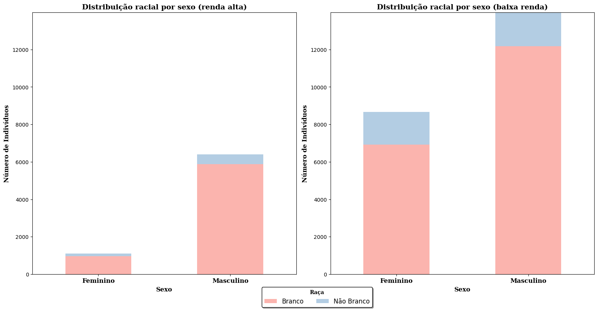
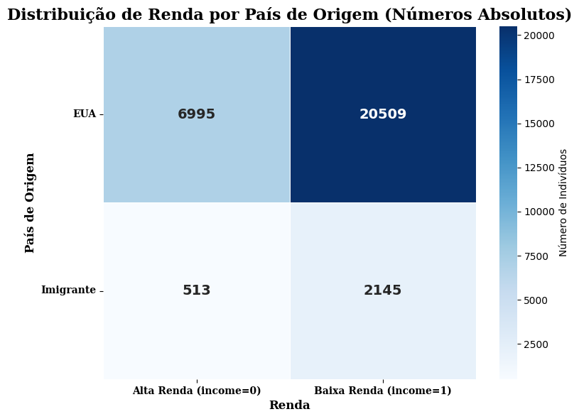
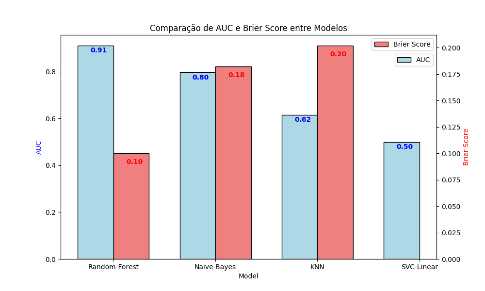
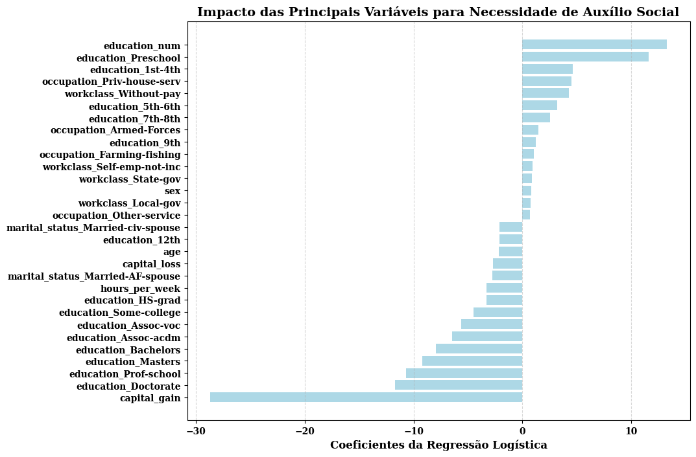
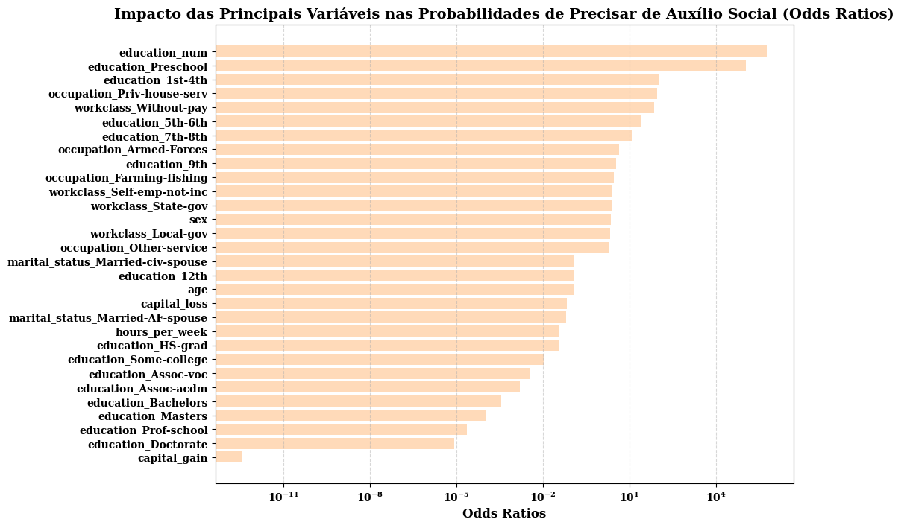
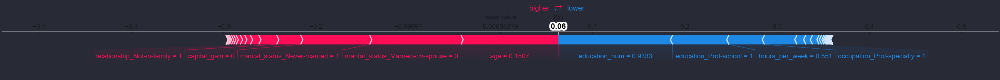
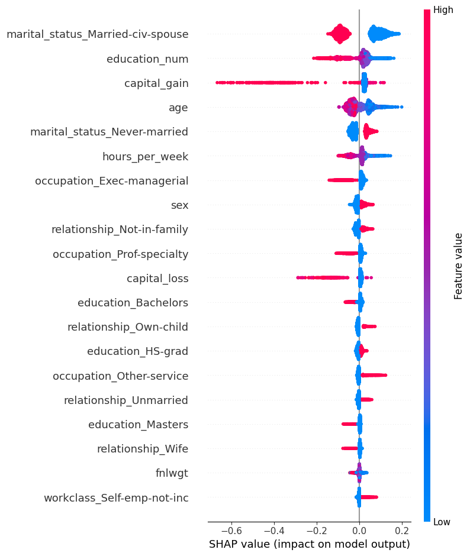
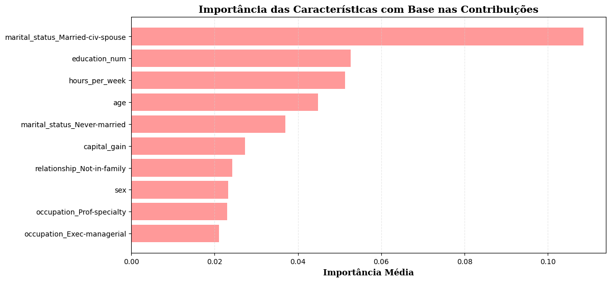

# Trustworthy Machine Learning - Projeto

Este repositório contém uma série de projetos relacionados às etapas do **Trustworthy Machine Learning**, com foco na análise, tratamento de dados, mitigação de vieses e fairness em modelos de aprendizado de máquina. O conjunto de projetos aqui agregados visa demonstrar boas práticas para garantir que modelos de IA sejam éticos, explicáveis e justos.

## Estrutura do Repositório

O repositório é dividido em quatro partes, cada uma representando uma etapa fundamental do Trustworthy Machine Learning:

1. **Análise e Tratamento de Dados** (Projeto 1)
2. **Treinamento e Otimização de Modelos** (Projeto 2)
3. **Explicabilidade e Interpretabilidade de Modelos** (Projeto 3)
4. **Fairness e Mitigação de Vieses** (Projeto 4)

Cada uma dessas etapas está documentada individualmente, com código, gráficos e análises detalhadas.

---

##  Projeto 1: Análise e Tratamento de Dados

### Objetivo

O primeiro projeto foca na análise exploratória de dados (EDA) e no tratamento de atributos sensíveis, utilizando o conjunto de dados **Adult Census Income**. O objetivo é compreender como os dados são distribuídos e identificar possíveis desbalanceamentos que podem impactar a justiça dos modelos de aprendizado de máquina.

###  Arquivos

- **notebooks/eda.ipynb**: Contém o código para análise exploratória dos dados.
- **data/adult.csv**: Conjunto de dados utilizado.
- **plots/**:
  - `sex_race_double_plot.png`: Distribuição racial por sexo e nível de renda.
  - `income_by_native_country_plot.png`: Distribuição de renda por país de origem.

### 📷 Visualizações

---

##  Projeto 2: Treinamento e Otimização de Modelos

### Objetivo

Nesta segunda etapa, o foco está no treinamento e otimização de hiperparâmetros de diversos modelos de aprendizado de máquina utilizando os dados tratados no **Projeto 1**.

###  Arquivos

- **notebooks/adult_modelling_training_and_tunning_opt_evaluate_on_validation_set.ipynb**
- **reports/Atividade_2_MO810__IA_Ética.pdf**
- **plots/**:
  - `roc_auc_and_brier_score.png`: Comparação de AUC e Brier Score entre modelos.

###  Visualizações

---

##  Projeto 3: Explicabilidade e Interpretabilidade de Modelos

### Objetivo

Esta etapa investiga como os modelos tomam decisões, explorando técnicas de interpretabilidade como **SHAP**, **Tree Interpreter** e **Regressão Logística**.

###  Arquivos

- **notebooks/explainability_analysis.ipynb**
- **reports/Atividade_3__IA_Ética.pdf**
- **plots/**:
  - `reg_log_interprtation.png`
  - `reg_log_odds_ratio.png`
  - `shap_force_plot_js.png`
  - `shap_force_plot_white_js.png`
  - `summary_plot_shap.png`
  - `tree-interpreter-importance.png`

###  Visualizações

---

##  Projeto 4: Fairness e Mitigação de Vieses

### Objetivo

Este projeto busca analisar e mitigar vieses algorítmicos no conjunto de dados **Adult Census Income**.

###  Arquivos

- **notebooks/fairness_notebook.ipynb**
- **reports/Atividade_4___IA_Ética.pdf**

###  Principais Descobertas

1. **Métricas de Fairness**:
   - Foram utilizadas **Statistical Parity Difference (SPD)**, **Disparate Impact (DI)** e **Equal Opportunity Difference (EOD)**.

2. **Técnicas de Mitigação Aplicadas**:
   - **Pré-processamento**: **Reweighting**
   - **Processamento**: **Fairness Penalty**
   - **Pós-processamento**: **Equalized Odds**

 **Conclusão**: Equalized Odds foi o método mais eficiente, reduzindo vieses sem comprometer significativamente a acurácia do modelo.

---

🔗 Para mais detalhes, consulte a documentação de cada projeto na respectiva pasta.

